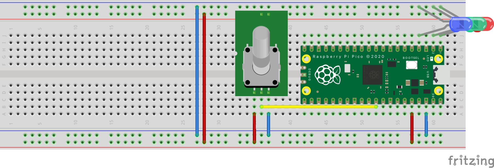
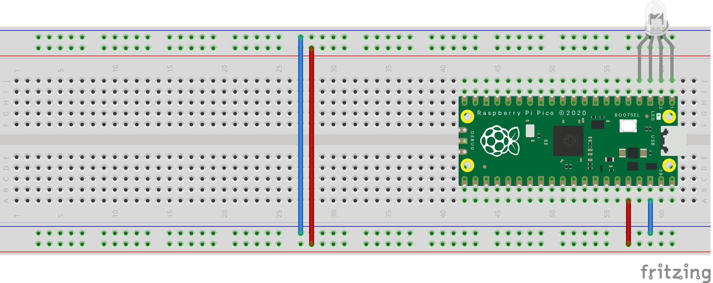

# Raspberry-pi-pico-curso
curso de raspberry pi pico

La Raspberry pi pico es una tarjeta pequeña, barata, muy rápida y que nos permite realizar muchos proyectos con un lenguaje de programación popular como lo es Python, las capacidades del microcontrolador de esta tarjeta supera con creces a los simples Arduino, además que cuenta con una gran documentación. 

# Códigos

1- [Parpadeo de Led](Codigos/blink.py) 

2- [lectura de pin digital](Codigos/2-lecturaDigital)

3- [Salida de pin PWM](Codigos/3-salidaAnalogica.py)

4- [Lectura analógica](Codigos/4-lecturaAnalogica.py)

5- [Lectura analógica y variables de escalado](Codigos/5-lecturaAnalogicaYvariables.py)

6- [Usos de IF - ELSE y ELIF](Codigos/6-IfElseElif.py)

7- [Manejo de ciclo For](Codigos/7-cicloFor.py)

8- [Manejo de listas](Codigos/8-manejoDeListas.py)

9- [Manejo de ciclo While](Codigos/9-cicloWhile.py)

10- [Manejo de funciones](Codigos/10-funciones.py)

11- [Manejo led RBG](Codigos/11-LedRGB.py)

12- [Manejo led RBG, con libreria math](Codigos/12-LibreriaMath.py)

13- [Manejo de Sensor de Fotocelda](Codigos/13-Sensor fotocelda.py)

14- [Manejo de sensor de ritmo cardiaco](Codigos/14-sensorRitmoCardiaco.py)

15- [Manejo de sensor de microfono](Codigos/15-sensorMicrofono.py)

* [Mi pagina WEB] (https://tutosingenieria1.blogspot.com/)
* [Mi canal de youtube] (https://www.youtube.com/c/TutosIngenieria)
* [Mi linkedin] (https://www.linkedin.com/in/debbiearredondo/)
* [Mi Instagram] (https://www.instagram.com/tutosingenieria)
